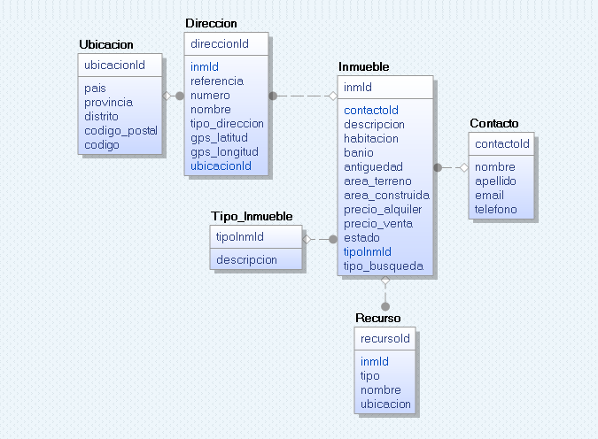
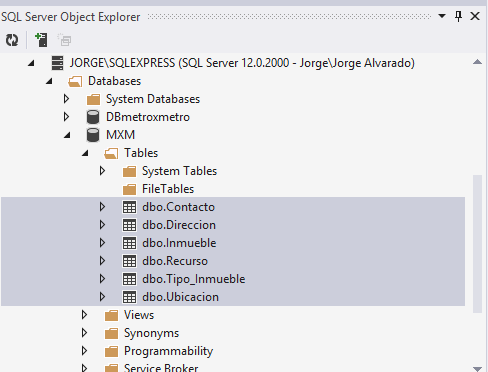
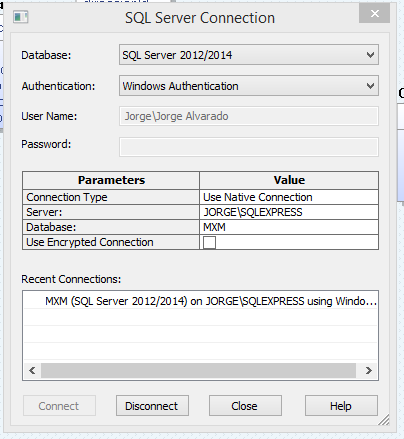
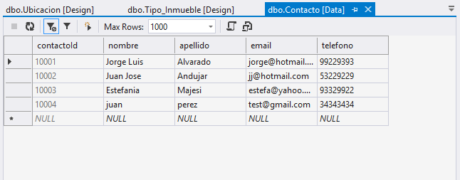

# Tutorial Web API con Asp.net  parte 1

### Introducción

El presente tutorial tendrá como objetivos desarrollar un servicio web API REST para consumo desde una aplicación *Web* o *Móvil*. Trabajaremos con la plataforma Microsoft en especial con asp.net. En primera instancia la aplicación desarrollada será local, pero la misma, con pocos esfuerzos puede modificarse para convertirse en una versión cloud en Azure.

Este proyecto nace por la necesidad de contar con material en español para este tema, con un ejemplo aplicable para introducir en el desarrollo de APIs Internet. También como un ejercicio para explorar y renovar prácticas de desarrollo.

El tutorial tendrá los siguientes pasos al detalle.

  - Diseñar un modelo de base de datos para la aplicación.
  - Diseñar un modelo de objetos correspondiente al modelo de datos.
  - Diseñar los objetos para el cliente.
  - Diseñar los controladores.
  - Diseñar la Vista y la página de ejemplo.

### El proyecto

El proyecto que desarrollaremos será una pequeña parte de una pagina web inmobiliaria, con un servicio web (REST) que publique información para este dominio, información de (casas, departamentos, oficinas), algo así como en la actualidad existen web sites para la búsqueda de información inmobiliaria.  Tales como [urbania][1], [adondevivir][1] entre otros. Este tipo de proyectos siguen vigentes en la actualidad dado el crecimiento y demanda inmobiliaria del país. 

Los requisitos para este proyecto son:
> Tener unas nociones básicas de patrones de diseño de aplicaciones, tales como Model- View-Controller y de Diseño de Base de Datos. Tener un conocimiento básico de conceptos de servicios Web.
 

### Requisitos técnicos generales

Para el desarrollo de la solución requeriremos algunas herramientas en la estación de trabajo:

1. Visual Studio 2013 CE ( Que incluye al framework .net 4.5).
2. SQL Server Express.
3. Internet Information Services activo.
4. Una versión de Chrome u otro navegador.

El proyecto lo desarrollaremos con C# como lenguaje principal. 

### La base de datos

Las base de datos que vamos a crear la diseñaremos con una herramienta bastante util para el modelamiento. Se trata de [CA ERwin Data Modeler CE][3], aunque existen muchas [otras][4] que se pueden considerar.

El modelo inicial de base de datos puede verse de la siguiente manera:
.
Aunque este diseño puede discutirse, tiene los datos suficientes para el proposito del tutorial.

Una vez que tenemos el diseño de la base de datos, debemos preocuparnos por los tipos de datos, rango de los campos y las relaciones entre las tablas. 

Desde Visual Studio, en la opción de SQL Server Object Explorer, podemos identificar la presencia del servidor SQL Server Express. En esta herramienta podemos crear la Base de Datos, luego con un script generado en CA ERwin podemos crear los objetos en la base de datos.

Para poder conectarnos desde CA ERWin Data modeler, necesitaremos definir una cadena de conexión a la base de datos. La misma que veremos en las propiedades de la base de datos desde el SQL Server Object Explorer desde el visual Studio.
.


### Instalación

Desde la herramienta CA ERwin Data modeler, una vez conectados:

 

podemos generar la Base de datos.

Tener en cuenta que se requerirá establecer permisos a la base de datos conforme se establezcan accesos desde otros servicios, por ejemplo si publicamos el proyecto en IIS. Tal como se define a continuación.

```SQL
 GRANT CONNECT TO [NT AUTHORITY\SERVICIO LOCAL];
 
 GRANT SELECT
    ON OBJECT::[dbo].[Contacto] TO [NT AUTHORITY\SERVICIO LOCAL]
    AS [dbo];


```

#### Datos
Una vez establecida la base de datos, procedemos a poblar algunas tablas para que nos sirvan en el ejemplo. 
En este proyecto hemos escogido un método de desarrollo de base de datos primero. Con el modelo de desarrollo de entidades que soporta ASP.net podemos escoger entre primero las entidades del modelo y luego la base de datos o primero la base de datos y luego el modelo. En este caso hemos escogido el segundo tipo solo por ser un enfoque algo tradicional. Sin embargo, ambos modelos son válidos y soportados por las herramientas.

Nuestras tablas a poblar son las siguientes, siempre respetando las relaciones que existen entre las entidades.

* Inmueble
* Contacto
* Direccion
* Ublicacion
* Recurso

Desde Visual Studio, podemos también poblar las tablas, sea desde sentencias SQL o desde una vista de datos:


Completado los datos, nuestro siguiente paso es centrarnos en el objetivo principal, crear los servicios. Esto lo veremos en las siguientes secciones.

[Parte 2](/introduccion_rest2.md)

[1]:http://www.urbania.com.pe
[2]:http://www.adondevivir.com
[3]:http://erwin.com/products/data-modeler
[4]:http://stackoverflow.com/questions/166557/a-good-database-modeling-tool