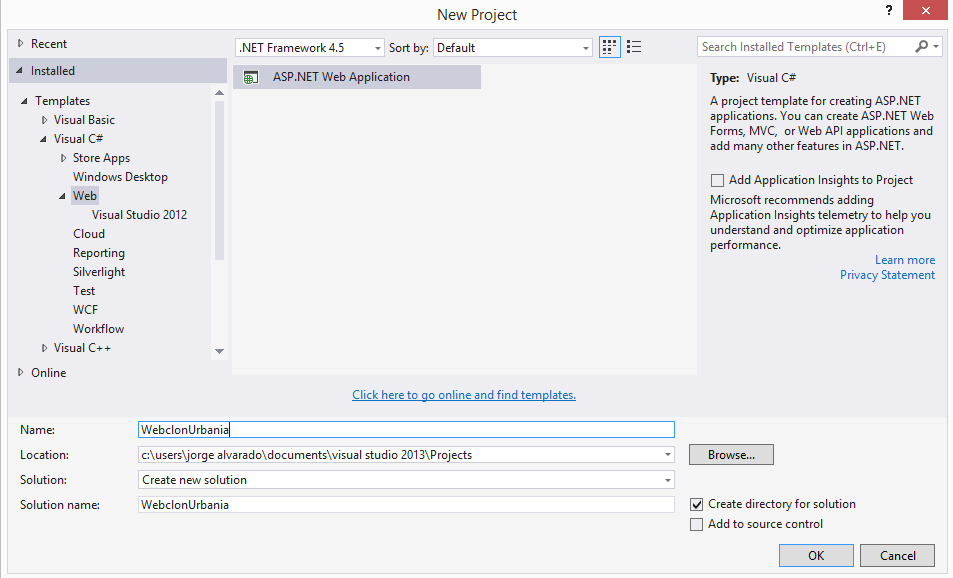
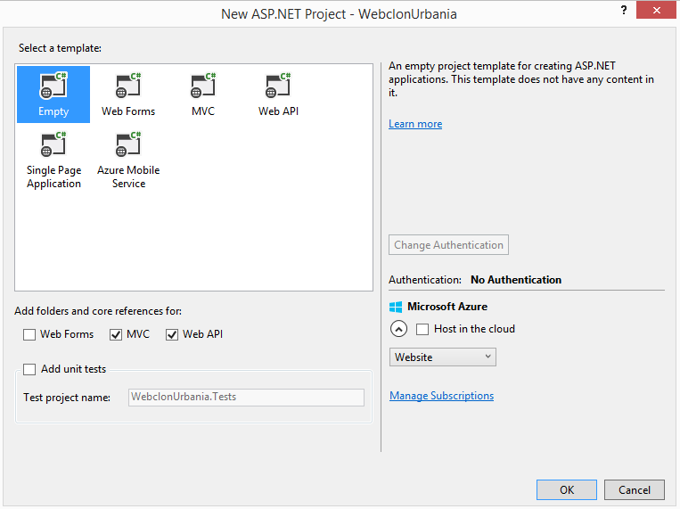
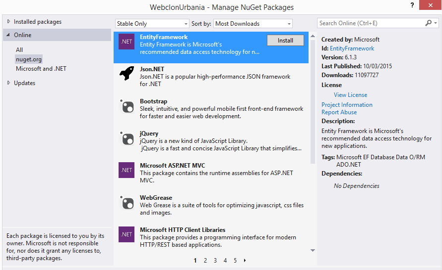
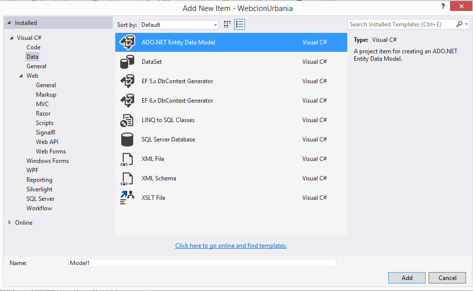
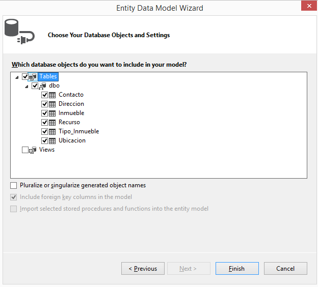
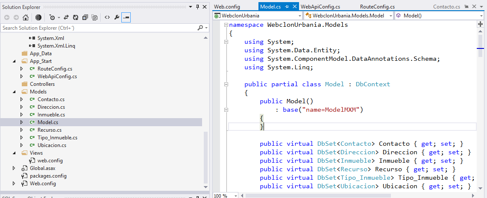

# Tutorial Web API con Asp.net parte 2

### Desarrollo del servicio

Muy bien!. Ya tenemos la base de datos lista para que sea publicada y consumida desde el servicio web REST.

Estamos listos para este desarrollo que nos permitirá crear una Web o o una aplicación Móvil, sea en Android, IOs, HTML5, etc.

>Visual Studio hay que reconocerlo, hace bastante trabajo por nosotros por lo que puede crear todo un servicio al vuelo con solo configurar la herramienta. Sin embargo para propositos de crear un aplicación con elementos básicos vamos a ser cuidadosos en el tipo de aplicación vamos a crear.

#### Crear la aplicación

En Visual Studio, seleccionamos la creación de una nueva aplicación Web vacía y seleccionamos los checkbox de MVC y Web API. Esto para que nos cree los elementos necesarios para operar los servicios. 


, podemos añadir unit test si deseamos.

Como podemos observar Visual Studio ha creado varios elementos pre-determinados para personalizar. Vamos a revisar esos elementos en las siguientes secciones.

####Crear el modelo de datos integrado a la Base de Datos.

Para crear la conexión a la base de datos y contar con un modelo para el proyecto, vamos a utilizar un paquete [NuGet][1]
Entity Framework. Para instalar este paquete debemos ir a Project-> Manage Nuget Packages. instalamos el paquete.



A continuación seleccionamos la carpeta Model y agregamos un nuevo item. Seleccionamos la opción de Data y procedemos a crear un modelo de datos de entidad ADO.NET. 




El siguiente paso es seleccionar el tipo de modelo que vamos a establecer en este proyecto. Como en la sección anterior hemos diseñado una base de datos, vamos a escoger la opción de "Code First from database". La herramientas nos pide seleccionar el origen de los datos. En el origen de datos seleccionamos la instancia de base de datos COMPUTERNAME\SQLEXPRESS y a continuación la base de datos. En nuestro ejemplo se llama MXM. 

Nuestra cadena de conexión queda así:

```sql
Data Source=JORGE\SQLEXPRESS;Initial Catalog=MXM;Integrated Security=True
```

>Los pasos que solicita la herramienta nos permite construir las clases que representan a las tablas de la Base de Datos. De acuerdo a la riqueza de nuestra base de datos, esta podría tener vistas, store procedure y funciones que podrían ser interpretadas en el modelo. Por ahora nuestro diseño solo tiene tablas y relaciones.



la herramienta genera clases del modelo. Como se puede apreciar en la figura:


Código generado desde la base de datos:
```c#
namespace WebclonUrbania.Models
{
    using System;
    using System.Data.Entity;
    using System.ComponentModel.DataAnnotations.Schema;
    using System.Linq;

    public partial class Model : DbContext
    {
        public Model()
            : base("name=ModelMXM")
        {
        }

        public virtual DbSet<Contacto> Contacto { get; set; }
        public virtual DbSet<Direccion> Direccion { get; set; }
        public virtual DbSet<Inmueble> Inmueble { get; set; }
        public virtual DbSet<Recurso> Recurso { get; set; }
        public virtual DbSet<Tipo_Inmueble> Tipo_Inmueble { get; set; }
        public virtual DbSet<Ubicacion> Ubicacion { get; set; }
        .
        .
        .

```

#### Comentarios 

Hasta aquí hemos logrado un gran avance. Tenemos la mitad del proyecto avanzado y no hemos programado prácticamente nada, solo hemos configurado y seleccionado opciones. Visual Studio simplifica muchas cosas del desarrollo, eso no quiere decir que no debamos programar, lo tendremos que hacer solo que en secciones centradas en la aplicación. 

Las clases del modelo bien pueden servir para ser enviadas a nuestro cliente consumidor del servicio, pero debemos tener en cuenta que enviar el modelo directamente crea la necesidad de que el cliente conozca lógica y propiedades del modelo que no necesariamiente las necesita. Este modelo está muy bien para los controller pero para que el cliente obtenga los datos es mejor que se aligeren un poco los objetos. Para ello se definen los DTO que no son más que versiones simplificadas de los objetos del modelo, para impedir algunos problemas de serialización y también encapsular el comportamiento de las clases del modelo. Ese tema lo veremos con detalle en la siguiente entrega.

[Parte 3](/introduccion_rest3.md)

[1]:https://www.nuget.org/