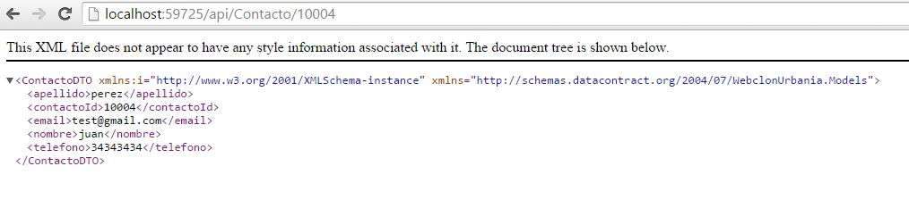
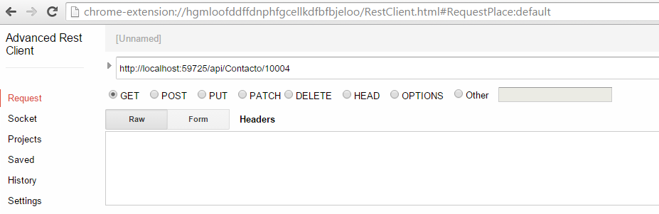
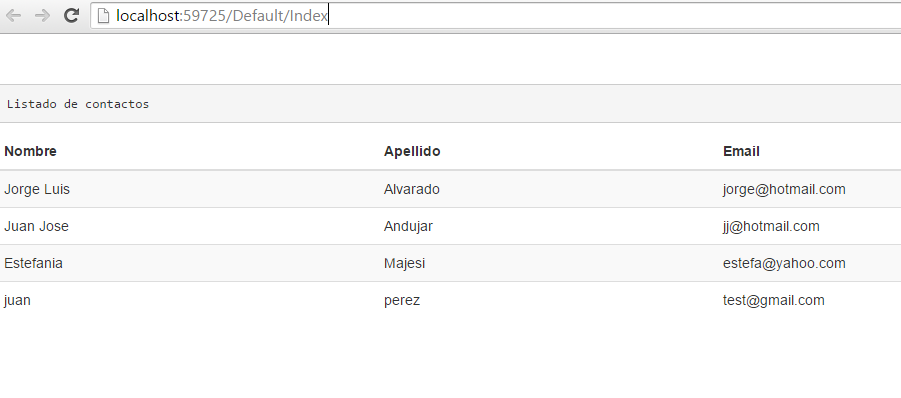

# Tutorial Web API con Asp.net parte 3

En esta sección terminaremos el tutorial y mostramos el consumo del servicio desde un simple pagina web. 
El proyecto está disponible en este repositorio y es libre de ser extendido o corregido.

#### Desarrollo de objetos DTO

Antes de pasar a trabajar sobre los Controller, vamos a definir objetos que sean manejados por el cliente consumidor del servicio. La literatura considera que es recomendable crear una capa de objetos [DTO](http://martinfowler.com/eaaCatalog/dataTransferObject.html) Data Transfer Oject, en vez de utilizar los objetos del modelo generado por el Entity Framework. El objetivo también es eliminar algunos problemas relacionados con las relaciones que pueden existir entre estas clases del modelo y que al momento de serializarse se generen recurrencias infinitas. 

En una próxima entrega se analizará este tema al detalle, incluyendo el uso de [automapper](http://automapper.org/) para automatizar el proceso de aligerar objetos.

Para crear las clases DTO, en la carpeta Model, agregemos una clase por cada tipo que queremos exponer a nuestro cliente, para propósitos de este tutorial solo consideraremos a dos elementos: ContactoDTO e InmuebleDTO. Tengamos en cuenta que las funciones de la lógica de la aplicación la responderán las clases Controller, los datos de esas respuestas u operaciones se basarán en estas clases nuevas.

Los pasos son:
* En la carpeta Model, agregar un nuevo item de tipo Código - Class con nombre ContactoDTO.cs.

```c#

using System;
using System.Collections.Generic;


namespace WebclonUrbania.Models
{
    public class ContactoDTO
    {
    }
}
```
Luego otra clase de nombre InmuebleDTO.cs

```c#
using System;
using System.Collections.Generic;


namespace WebclonUrbania.Models
{
    public class InmuebleDTO
    {
    }
}
```

* Ahora definamos las propiedades de los objetos DTO que tengan correspondencia con sus pares en el modelo de clases vinculado a la base de datos

La lógica es que estos objetos serán los que se enviarán en las funciones que envían o reciben datos de los servicios públicos. Este comportamiento se define en los Controller.

Vamos ahora a realizar esta tarea:


```c#

using System;
using System.Collections.Generic;

//La clase ContactoDTO.cs

namespace WebclonUrbania.Models
{
    public class ContactoDTO
    {
        public ContactoDTO()
        {
        }

        public int contactoId { get; set; }
        public string nombre { get; set; }
        public string apellido { get; set; }
        public string email { get; set; }
        public string telefono { get; set; }
    }
}

```
```c#

using System;
using System.Collections.Generic;

//Y la clase InmuebleDTO.cs

namespace WebclonUrbania.Models
{
    public//Y la clase InmuebleDTO.cs
    class InmuebleDTO
    {

        public InmuebleDTO()
        {
        }

        public int? contactoId { get; set; }

        public int inmId { get; set; }

        public string descripcion { get; set; }

        public int? habitacion { get; set; }

        public decimal? banio { get; set; }

        public int? antiguedad { get; set; }

        public int? area_terreno { get; set; }

        public int? area_construida { get; set; }


    }
}

```
#### Los controller

Una vez establecidas nuestras clases para el intercambio de información entre el cliente y el servicio ahora vamos a trabajar sobre los controler. Que en primera instancia solo harán el trabajo de copiar datos del modelo a estos objetos. 

Seleccionamos la carpeta Controller y agregamos un nuevo item de tipo Controller. En la ventaja de selección, escogemos Web API2 Controller - Empty. Recordar que el nombre debe contener la palabra Controller al final del nombre. En este caso le pondremos ContactoController.

Nuestra clase queda de esta manera, una vez generada con el asistente.

```c#

using System;
using System.Collections.Generic;
using System.Linq;
using System.Net;
using System.Net.Http;
using System.Web.Http;

namespace WebclonUrbania.Controllers
{
    public class ContactoController : ApiController
    {
    }
}

```

Ahora procederemos a escribir algo de código para exponer dos métodos uno que permita una consulta de todos los contactos que tiene esta entidad (GetContacto) y otro que me permita realizar una consulta por su ID (GetContacto(Id)). 

Veamos como quedan estas funciones:

```c#

using System;
using System.Collections.Generic;
using System.Linq;
using System.Net;
using System.Net.Http;
using System.Web.Http;
using System.Web.Http.Description;
using WebclonUrbania.Models;

namespace WebclonUrbania.Controllers
{
    public class ContactoController : ApiController {

        private Model db = new Model();


        // GET: api/Contacto
        public IEnumerable<ContactoDTO> GetContacto()
        {

            IQueryable<Contacto> contactos = db.Contacto;
            ContactoDTO element = new ContactoDTO();
            List<ContactoDTO> contactosAPI = new List<ContactoDTO>();


            foreach (Contacto e in contactos)
            {
                element.contactoId = e.contactoId;
                element.nombre = e.nombre;
                element.apellido = e.apellido;
                element.email = e.email;
                element.telefono = e.telefono;
                contactosAPI.Add(element);
                element = new ContactoDTO();

            }
            return contactosAPI;

        }

        // GET: api/Contacto/10005
        [ResponseType(typeof(ContactoDTO))]
        public IHttpActionResult GetContacto(int id)
        {
            Contacto contacto = db.Contacto.Find(id);

            ContactoDTO element = new ContactoDTO();

            if (contacto == null)
            {
                return NotFound();
            }

            element.contactoId = contacto.contactoId;
            element.nombre = contacto.nombre;
            element.apellido = contacto.apellido;
            element.email = contacto.email;
            element.telefono = contacto.telefono;

            return Ok(element);
        }


    }
}
```
#### Observaciones
* Tenemos que agregar una referencia al módulo del Modelo
* En la clase hacemos referencia al modelo con la variable Model db.
* Vamos a crear una lista de elementos ContactoDTO iterando la clase del modelo Contacto.

Terminado este punto nosotros ya podemos probar el servicio. 

Simplemente ejecutamos el servicio y desde el navegador o una extensión de Chrome que permita enviar request y post podremos probar el servicio.

Veamos el ejemplo:
XML
 
JSON (instalar la extensión Chrom Advance Request Client)


Como podemos observar el servicio se encuentra disponible en la siguiente URL:

localhost/API/[nombre controller]

Esto es posible porque Visual Studio ya nos ha generado previamente código para establecer esas invocaciones.

Tal como podemos ver en:

WebclonUrbania/App_Start/WebAPIConfig.cs
````c#
using System;
using System.Collections.Generic;
using System.Linq;
using System.Web.Http;

namespace WebclonUrbania
{
    public static class WebApiConfig
    {
        public static void Register(HttpConfiguration config)
        {
            // Web API configuration and services

            // Web API routes
            config.MapHttpAttributeRoutes();

            config.Routes.MapHttpRoute(
                name: "DefaultApi",
                routeTemplate: "api/{controller}/{id}",
                defaults: new { id = RouteParameter.Optional }
            );
        }
    }
}


````

El mismo proceso lo repetimos para la clase InmuebleDTO. Lo dejo como ejercicio para el lector. 

Lo siguiente que vamos a ver es crear una Vista, que consuma el servicio y nos muestre una consulta de los datos.

#### La vista

Nuestro servicio es funcional y está listo para ser consumido, la información que hemos visto hasta ahora invocando la dirección "http//server/api/Controller" nos permite obtener la información deseada. Esta información podemos consumirla desde un cliente. Sea una web o una aplicación móvil.

Para nuestro tutorial, crearemos una pequeña vista Web que nos permita mostrar el listado de contactos. Vamos a crearlo en este mismo proyecto, por lo que de algún modo estaremos creando un proyecto hibrido un módulo API REST y una página cliente que lo consume.


Muy bien, solo para propósito de mostrar como actualizar ciertas librerías en nuestro proyecto, vamos a instalar las últimas versiones de Jquery y bootstrap desde la consola de paquetes Nuget.

Nos dirigimos a Tools->Nuget Package Manager -> Package Manager Console

ejecutamos los comandos:

```javascript
Install-Package Jquery

```
Esta operación retirará la versión anterior de jquery y tendremos la última.

```javascript
Install-Package bootstrap
````
Lo mismo para esta librería bootstrap.

```javascript
Install-Package knockoutjs

```
También vamos a utilizar la librería knockout js.

Ahora, vamos a agregar una página por defecto que haga la operación de consumo del servicio. Para ello requeriremos dos pasos:
1. Crear un Controlador MVC para esta pagina.
2. Crear la Vista MVC consumir el servicio WEB API.

##### Crea un controlador MVC para la pagina

la página por default tendrá un controlador por default. Para ello nos vamos a la carpeta Controller y agregamos un nuevo item controller, seleccionamos Un MVC 5 Controller Empty, de nombre le ponemos DefaultController.cs. Observemos que en la carpeta Views, se ha agregado una carpeta Default. 

La clase generada se verá de la siguiente manera:
```c#
using System.Web;
using System.Web.Mvc;

namespace WebclonUrbania.Controllers
{
    public class DefaultController : Controller
    {
        // GET: Default
        public ActionResult Index()
        {
            return View();
        }
    }
}
```

##### Crear la vista

Ahora nos vamos a la carpeta View->Default y agregamos un nuevo elemento de tipo View con nombre Index ( sin plantilla). Esto generará un archivo index.cshtml. 

Como nuestro controller se llama "DefaultController", vamos a verificar en App_Start/RouteConfig.cs si estamos llamando por el nombre correcto al controllador por defecto. 

```c#
    defaults: new { controller = "Default", action = "Index", id = UrlParameter.Optional }

```

El código HTML quedará de la siguiente manera:
```html


@{
    Layout = null;
}

<!DOCTYPE html>

<html>
<head>
    <meta name="viewport" content="width=device-width" />
    <title>Contactos</title>
    <link href="~/Content/Site.css" rel="stylesheet" type="text/css" />
    <link href="~/Content/bootstrap.min.css" rel="stylesheet" type="text/css" />
    <script src="~/Scripts/modernizr-2.6.2.js"></script>

</head>
<body>
    <div>
        <pre>Listado de contactos</pre>
    </div>

    <div class="table-responsive">
        <table class="table table-striped">
            <thead>
                <tr>
                    <th>Nombre</th>
                    <th>Apellido</th>
                    <th>Email</th>
                </tr>
            </thead>
            <tbody data-bind="foreach: contacto">
                <tr>
                    <td data-bind="text: nombre">
                    </td>
                    <td data-bind="text: apellido">
                    </td>
                    <td data-bind="text: email">
                    </td>
                </tr>
            </tbody>
            </table>
    </div>

                    <script src="~/Scripts/jquery-2.1.4.min.js"></script>
                    <script src="~/Scripts/bootstrap.min.js"></script>
                    <script src="~/Scripts/jquery-2.1.4.js"></script>
                    <script src="~/Scripts/knockout-3.3.0.debug.js"></script>
                    <script>
                        var ViewModel = function () {
                            var self = this;
                            self.contacto = ko.observableArray();
                            self.error = ko.observable();

                            var contactoUri = '/api/Contacto/';

                            function ajaxHelper(uri, method, data) {
                                self.error('');
                                return $.ajax({
                                    type: method,
                                    url: uri,
                                    dataType: 'json',
                                    contentType: 'application/json',
                                    data: data ? JSON.stringify(data) : null
                                }).fail(function (jqXHR, textStatus, errorThrown) {
                                    self.error(errorThrown);
                                });
                            }

                            function getcontacto() {
                                ajaxHelper(contactoUri, 'GET').done(function (data) {
                                    self.contacto(data);
                                });
                            }


                            getcontacto();
                        };

                        ko.applyBindings(new ViewModel());

                    </script>
</body>

</html>

```

#### Observaciones

El código javascript de la página puede ir en un archivo .js aparte, no es necesario incluirlo en la página. Lo que si es importante es que estos script se ejecuten despues del html que asocia los datos (binding). Este script invoca al servicio REST y crea un array con los datos. El siguiente HTML asocia ese array con los elementos del documento.

```html
            <tbody data-bind="foreach: contacto">
                <tr>
                    <td data-bind="text: nombre">
                    </td>
                    <td data-bind="text: apellido">
                    </td>
                    <td data-bind="text: email">
                    </td>
                </tr>
            </tbody>

```
El html mostrado es el responsable para realizar el pintado de los datos del servicio. El texto foreach duplica la sección de HTML e inserta los datos del array de datos obtenidos del servicio en el HTML.

Esta simplificación de código cliente se logra con la librería [knockout](knockoutjs.com/documentation/foreach-binding.html).



#### Conclusiones

Espero que hayan disfrutado este ejemplo, el proyecto completo se encuentra en [github](https://github.com/jrevatta/Web-API) y puede extenderse a más funcionalidad. 

En próximas entregas, veremos como ampliar los servicios REST y el consumo de los mismos desde otros tipos de clientes, por ejemplo una aplicación Android que consuma estos servicios. También publicar estos servicios en Azure.

Muchas gracias y hasta la próxima.

Jorge Alvarado